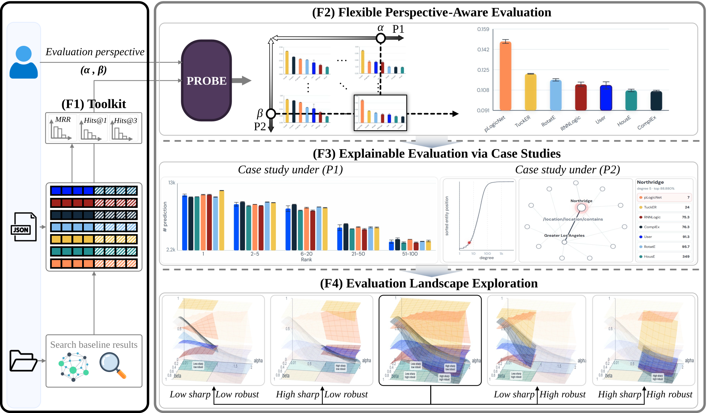

# PROBE<sup>Web</sup>



An interactive, browser-based system for probing evaluation landscapes of knowledge graph completion (KGC) models. PROBE<sup>Web</sup> accompanies the CIKM 2026 demo paper, [*PROBE<sup>Web</sup>: An Interactive System for Probing Evaluation Landscapes of Knowledge Graph Completion Models*](https://arxiv.org/pdf/2606.08926).

The interface compares uploaded KGC predictions with bundled baselines, reports conventional metrics alongside PROBE scores, and supports interactive analysis of predictive sharpness and popularity-bias robustness. All scoring runs locally in the browser; uploaded files are not sent to a server.

## Quick start

The project is a static site—no package installation or build step is needed. Serve the repository root so the browser can load the bundled JSON and dataset files:

```powershell
python -m http.server 8788 --bind 127.0.0.1
```

Then open <http://127.0.0.1:8788/>.

## Use the demo

### Compare bundled baselines

1. Enable **Baselines only**.
2. Enter a bundled dataset name (`FB15k237`, `wn18rr`, `YAGO3-10`, `family`, `umls`, or `kinship`), or leave it empty to use the first available dataset.
3. Select **Run comparison**.

### Compare your model

1. Enter the dataset name used for the matching bundled baselines, if desired.
2. Upload `entities.dict` and `train.txt`; `relations.dict` is optional but enables readable relation names in the subgraph view.
3. Add one or more model rows and upload result JSON files. Each file must be a JSON array of records in this form:

   ```json
   [[[head_id, relation_id, tail_id], "h", rank], [[head_id, relation_id, tail_id], "t", rank]]
   ```

4. Select **Run comparison**. Results can be exported as JSON, CSV, SVG, or via the browser print dialog.

PROBE<sup>Web</sup> uses the transformed-rank and entity-weighted metric defined in `DEMO_PROBE.py`. The default views include `(alpha, beta)` pairs `(1.0, 0.0)`, `(0.5, 0.0)`, `(0.25, 0.0)`, `(1.0, 0.4)`, and `(1.0, 0.8)`; the interactive view supports continuous values.

## Repository layout

| Path | Purpose |
| --- | --- |
| `index.html`, `app.js`, `styles.css` | Static web application |
| `n_infos/` | Normalized, precomputed baseline prediction results |
| `data/` | Bundled benchmark files used by the baseline-only workflow |
| `baseline-manifest.json` | Maps available datasets and baseline result files |
| `DEMO_PROBE.py` | Minimal Python reference for the PROBE metric |
| `generate_baseline_manifest.py` | Regenerates or verifies the baseline manifest |

The ignored `infos/` and `Ours/` directories hold large, intermediate experiment outputs and are not part of the public web deployment.

## Deployment

Deploy the repository root as a static site. For Cloudflare Pages, use:

- Framework preset: `None`
- Build command: *(empty)*
- Build output directory: `.`

The `_headers` file supplies security headers for hosts that support the Cloudflare Pages headers format. The full `data/` and `n_infos/` folders must be deployed for the bundled baseline-only workflow.

## Maintaining baseline data

Whenever files under `n_infos/` change, regenerate the manifest before deploying:

```powershell
python generate_baseline_manifest.py
python generate_baseline_manifest.py --check
```

## Citation

If you use PROBE<sup>Web</sup>, please cite the accompanying CIKM 2026 demo paper:

```text
@inproceedings{moon2026probe,
  title={PROBE-Web: An Interactive System for Probing Evaluation Landscapes of Knowledge Graph Completion Models},
  author={Moon, Sooho and Ko, Yunyong},
  booktitle={Proceedings of the 35th ACM international conference on information and knowledge management},
  year={2026}
}
```

Please replace the placeholder citation above with the final bibliographic entry from the camera-ready paper once it is available.
